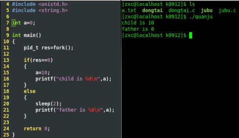
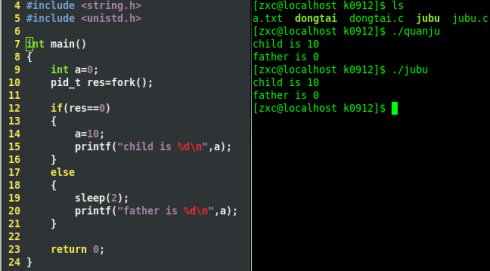
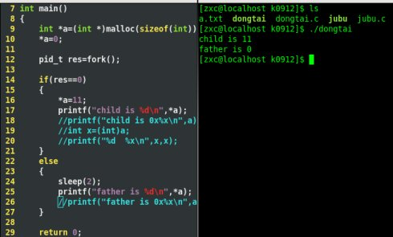
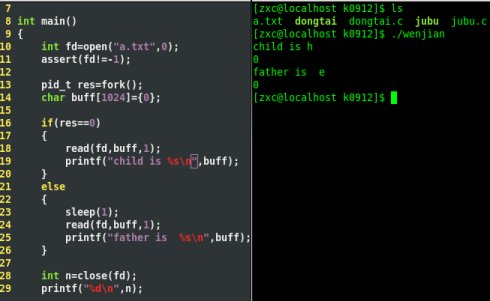

# Linux：fork父子进程间共享数据
fork()函数出的父子进程之间存在着代码的拷贝，且父子进程都相互独立执行，那么父子进程是否共享同一段数据，即是否存在着数据共享。

在Linux下，内存存储的位置是全局变量，栈区，堆区，以及文件。字符常量区我们这里先不作分析。下面我们依次以实际代码来验证它们是否存在着数据共享。所谓的父子进程数据共享，通俗点说就是父进程或者子进程对数据的更改，会使得子进程或者父进程的数据同步更改。代码检测的思想是让父子进程中的一个修改数据，未对数据修改的进程调用数据，查看是否数据被修改，如果数据被修改，那么证明两者之间存在着数据共享，反之没有。

## 全局变量
```c
#include <unistd.h>
#include <string.h>

int a=0;
int main()
{
    pid_t res=fork();
    if(res==0)
    {
        a=10;
        printf("child is %d\n",a);
    }
    else
    {
        sleep(2);
        printf("father is %d\n",a);
    }
    return 0;
}
```
代码运行的结果如下：



通过结果得知，子进程对数据a进行了修改，但是父进程获取的数据却任然是初始化的值。所以我们可以得知，在数据类型为全局变量时，父子进程之间的数据不共享。
## 栈区（局部变量）
```c
#include <unistd.h>
#include <string.h>


int main()
{
    int a=0;
    pid_t res=fork();
    if(res==0)
    {
        a=10;
        printf("child is %d\n",a);
    }
    else
    {
        sleep(2);
        printf("father is %d\n",a);
    }
    return 0;
}
```
代码运行的结果如下：



可以看到，运行的结果与全局变量得到的结果一样，所以当数据类型为局部变量的时候，父子进程之间的数据不共享。
## 堆区（动态内存）
```c
#include <unistd.h>
#include <string.h>


int main()
{
    int *a=(int *)malloc(sizeof(int));
    *a=0;

    pid_t res=fork();
    if(res==0)
    {
        *a=11;
        printf("child is %d\n",a);
    }
    else
    {
        sleep(2);
        printf("father is %d\n",a);
    }
    return 0;
}
```
代码运行的结果如下：



可以看出，同样未有改变，当数据类型是动态开辟时，父子进程的数据不共享。
## 文件
在文件a.txt中存放了字符串hello world，然后父子进程分别去读文件，发现文件描述符偏移了2次。
```c
int main()
{
    int fd=open("a.txt",0);
    assert(fd!=-1);

    pid_t res=fork();
    char buff(1024)={0};

    if(res==0)
    {
        read(fd,buff,1);
        printf("child is %s\n",buff);
    }
    else
    {
        sleep(1);
        read(fd,buff,1);
        printf("father is %s\n",buff);
    }
    int n=close(fd);
    printf("%d\n",n);
}
```



通过结果我们可以看出，对于数据类型为文件时，父子进程之间共享数据，具体而言是共享了文件偏移量。

## 结论

全局变量 | 栈区（局部变量） | 堆区（动态开辟） | 文件
:-: | :-: | :-: | :-:
不共享 | 不共享 | 不共享 | 共享文件偏移量