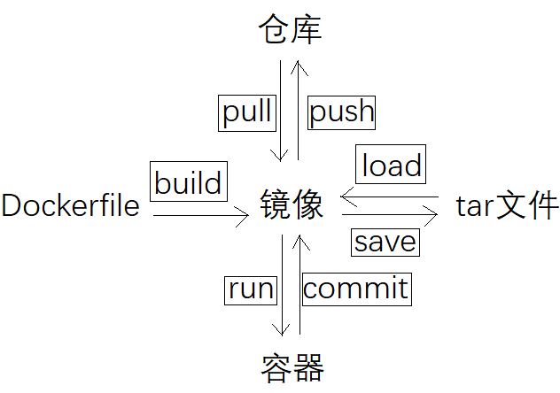

## 基本命令行操作概念


### pull
```
docker 镜像 库名(:版本)
```


### run
```
docker run (-d#后台运行)(-p 80:80#端口映射) (--name 容器名) (-v 宿主目录:容器目录) 镜像
```

### ps
```
docker ps #查看正在运行的容器
```

### exec
```
docker exec -it 容器 bash
```

### rm
```
docker rm -f 容器
```

### rmi
```
docker rmi 镜像
```

### commit
```
docker commit 容器 镜像
```

### images
```
docker images
```

### build
```
docker build
```

### inspect
```
docker docker inspect
```

## dockerfile基本格式

### FROM
```
FROM 镜像(:版本)
```

### WORKDIR
```
WORKDIR 路径 #自动创建运行路径
```

### COPY
```
COPY 宿主机目录 容器目录 #宿主机文件拷贝到容器中
```

### RUN
```
RUN shell #运行shell语句
```

### CMD
```
CMD shell
```

### ADD

### EXPOSE

### VOLUME

### ENV

### ARG

### LABEL
 
### ONBUILD

### SHELL