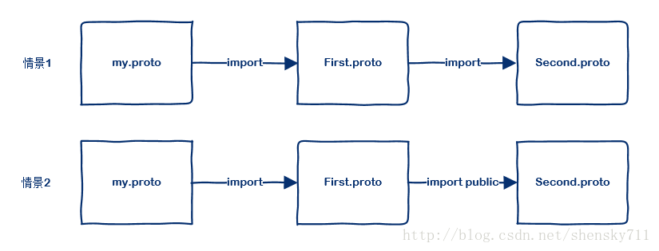

<!--
 * @Author: zhangjiaxi
 * @Date: 2021-03-02 14:43:35
 * @LastEditors: zhangjiaxi
 * @LastEditTime: 2021-03-02 16:48:18
 * @FilePath: /learning_note/protocol_buffers.md
 * @Description: 
-->
# 简介
Protocol Buffers是google的一种数据交换格式，它独立于语言，独立于平台。由于它是一种二进制格式，比使用xml进行数据交换快很多。可以把它用于分布式应用之间的数据通信或者异构环境下的数据交换。

# proto3语法
## 定义一个Message
首先我们来定义一个Search请求，在这个请求里面，我们需要给服务端发送三个信息：
- query：查询条件
- page_number：想要哪一页数据
- result_per_page：每一页有多少条数据
于是我们可以这样定义：
```
// 制定使用proto3,如果不指定的话，编译器会使用proto2去编译
syntax = "proto3";

message SearchRequests{
    // 定义SearchRequests的成员变量，需要指定：变量类型、变量名、变量Tag
    string query = 1;
    int32 page_number = 2;
    int32 result_per_page = 3;
}

message SearchResponse{
    repeated string result = 1;
}
```

message可以嵌套定义，比如message可以定义在另一个message内部

```
meassage SearchResponse{
    message Result{
        string url = 1;
        string title = 2;
        repeated string snippets = 3;
    }
    repeated Result results = 1;
}
```

定义在message内部的message可以这样使用：
message SomeOtherMessage{
    SearchResponse.Result result = 1;
}

## 定义变量类型

在上面的例子中，我们使用了2个标准值类型：string和int32，除了这些之外，变量的类型还可以是复杂类型，比如自定义的枚举和自定义的message。

.proto | 说明 | c++ | Java | Python | Go | Ruby | C# | PHP
:-: | :-: | :-: | :-: | :-: | :-: | :-: | :-: | :-: 
double |   | double | double | float | float64 | Float | double | float
float |   | float | float | float | float32 | Float | float | float
int32 | 使用变长编码，对负数编码效率低 | int32 | int | int | int32 | Fixnum or Bignum (as required) | int | integer
int64 | 使用变长编码，对负数编码效率低 | int64 | long | int/long | int64 | Bignum | long | integer/string
uint32 | 使用变长编码 | uint32 | int | int/long | uint32 | Fixnum or Bignum (as required) | uint | 	integer
uint64 | 使用变长编码 | uint64 | long | int/long | uint64 | Bignum | ulong | integer/string
sint32 | 使用变长编码，带符号的int类型，对负数编码比int32高效 | int32 | int | int | int32 | Fixnum or Bignum (as required) | int	 | integer
sint64 | 使用变长编码，带符号的int类型，对负数编码比int64高效 | int64 | long | int/long | int64 | Bignum | 	long | integer/string
fixed32 | 4字节编码， 如果变量经常大于228 的话，会比uint32高效 | uint32 | int | int | int32 | Fixnum or Bignum (as required) | 	uint | integer
fixed64 | 8字节编码， 如果变量经常大于256 的话，会比uint64高效 | uint64 | long | int/long | uint64 | Bignum | ulong | integer/string
sfixed32 | 4字节编码 | int32 | int | int | int32 | Fixnum or Bignum (as required) | int | integer
sfixed64 | 8字节编码 | int64 | long | int/long | int64 | Bignum | long | integer/string
bool |   | bool | boolean | bool | bool | TrueClass/FalseClass | bool | boolean
string | 必须包含utf-8编码或者7-bit ASCII text | string | String | str/unicode | string | String (UTF-8) | 	string | string
bytes | 任意的字节序列 | string | ByteString | str | []byte | String(ASCII-8BIT) | ByteString | string
## 分配Tag
每个变量在message内部都需要自定义一个唯一的数字Tag，protobuf会根据Tag从数据中查找变量对应的位置，具体原理跟protbuf的二进制数据格式有关。Tag一旦指定，以后更新协议的时候也不能修改，否则无法对就版本兼容。
Tag的取值范围最小是1,最大是2<sup>29</sup>-1，但19000～19999是protobuf预留的，用户不能使用。
虽然Tag的定义范围比较大，但不同Tag也会对protobuf编码带来一些影响：
- 1～15：单字节编码
- 16～2047：双字节编码
使用频率高的变量最好设置为1～15,这样可以减少编码后的数据大小，但由于Tag一旦指定不能修改，所以为了以后扩展，也记得为未来保留一些1～15的Tag
## 指定变量规则
在proto3中，可以给变量指定以下两种规则：
- singular：0或者1个，但不能多与1
- repeated：任意数量（包括0）
当构建message的时候，build数据的时候，会检测设置的数据跟规则是否匹配
在proti2中，规则为：
- required：必须有一个
- optional：0或1个
- repeated：任意数量（包括0）

## 注释
用//表示注释开头

## 保留变量不被使用
上面我们说到，一旦Tag指定后就不能变更，这样会带来一个问题，假如在版本1的协议中，我们有个变量：
```
int32 number = 1;
```

在版本2中，我们决定废弃对它的使用，那应该如何修改协议呢？
我们可以用reserved关键字，当一个变量不再使用的时候，我们可以把它的变量名或Tag用reserved标注，这样，当这个Tag或者变量名重新使用的时候，编译器会报错
```
message Foo{
    // 注意，同一个reserved语句不能同时包含变量名和Tag
    reserved 2,15,9 to 11;
    reserved "foo","bar"
}
```

## 默认值
当解析message时，如果被编码的message里没有包含某些变量，那么根据类型不同，他们会有不同的默认值：
- string：空字符串
- byte：空bytes
- bool：false
- numeric：0
- enums：定义在第一位的枚举值，也就是0
- messages：根据生成的不同语言有不同的表现

## 定义枚举Enumerations
```
message SearchReques{
    string query = 1;
    int32 page_number = 2;
    int32 result_per_page = 3;
    enum Corpus{
        UNIVERSAL = 0;
        WEB = 1;
        IMAGES = 2;
        LOCAL = 3;
        NEWS = 4;
        PRODUCTS = 5;
        VIDEO = 6;
    }
    Corpus corpus = 4;
}
```
枚举定义在一个消息内部或消息外部都可以，如果枚举定义在message内部，而其它message又想使用，那么可以通过MessagType.EnumType的方式引用。定义枚举的时候，我们保证第一个枚举值必须是0,枚举值不能重复，除非使用option allow_alias = true选项类开启别名。如：
```
enum EnumAllowingAlias{
    option allow_alias = true;
    UNKNOWN = 0
    STARTED = 1;
    RUNNING = 1;
}
```
枚举值的范围是32bit integer，但因为枚举值使用变长编码，所以不推荐使用负数作为枚举值，因为会带来效率问题。

## 如何引用其他proto文件

在protobuf语法中，有两种引用其它proto文件的方法：import和import public。



- 在情景1中，my.proto不能使用second.proto中定义的内容
- 在情景2中，my.proto可以使用second.proto中定义的内容
- 情景1和情景2中，my.proto都可以使用first.proto
- 情景1和情景2中，first.proto都可以使用second.proto

```
// my.proto
import "first.proto";
```

```
// first.proto
// import "second.proto";
import public "second.proto";
```

## 升级proto文件正确的姿势
升级更改proto需要遵循以下原则
- 不要修改任何已存在的变量的Tag
- 如果你新增了变量，新生成的代码依然能解析旧的数据，但新增的变量将会编程默认值。相应的，新代码序列化的数据也能被旧的代码解析，但旧代码会自动忽略新增的变量
- 废弃不用的变量用reserved标注
- int32\uint32\int64\uint64和bool是相互兼容的，这意味着你可以更改这些变量的类型而不会影响兼容性
- sint32 和 sint64 是兼容的，但跟其他类型不兼容
- string 和 bytes 可以兼容，前提是他们都是UTF-8编码的数据
- fixed32 和 sfixed32 是兼容的, fixed64 和 sfixed64是兼容的

## Any的使用
Any可以让你在proto文件中使用未定义的类型，具体里面保存什么数据，是在上层业务代码使用的时候决定的，使用Any必须导入import google/protobuf/any.proto

```
import "google/protobuf/any.proto";

message ErrorStatus{
    string message = 1;
    repeated google.protobuf.Any details = 2;
}
```

## Oneof的使用
Oneod类似union，如果你的消息中有很多可选字段，而同一时刻最多仅有其中的一个字段被设置的话，你可以使用oneof来强化这个特性并且节约存储空间，如：

```
message LoginReply{
    oneof test_oneof{
        string name = 3;
        string age = 4;
    }
    required string status = 1;
    required string token = 2;
}
```

这样，name和age都是LoginReply的成员，但不能给他们同时设置值。

## Maps的使用
protobuf支持定义map类型的成员，如：
```
map<key_type,value_type> map_field = N;
// 举例：map<string,Project> projects = 3;
```
- key_type：必须是string或者int
- value_type：任意类型
使用map要注意：
- Map类型不能使用repeated
- Map是无序的
- 以文本格式展示时，Map以key来排序
- 如果有相同的键会导致解析失败

## Package的使用
为了防止不同消息之间的命名冲突，可以对特定的.proto文件指定package名字。在定义消息的成员的时候，可以指定包的名字：

```
package foo.bar;
message Open{...}
```

```
message Foo{
    ...
    // 带上包名
    foo.bar.Open open = 1
    ...
}
```
# 定义Service
要定义一个服务，必须在.proto文件中指定service
```
service RouteGuide{
    ...
}
```

然后在我们的服务中定义rpc方法，指定它们的请求和响应类型。gRPC允许定义4中类型的service方法

## 简单RPC
客户端使用Stub发送请求到服务器并等待响应返回，就像平常的函数调用一样，这是一个阻塞型的调用
```
rpc GetFeature(Point) returns(Feature){}
```

## 服务端流式RPC
客户端发送请求到服务器，拿到一个流去读取返回的消息序列。客户端读取返回的流，直到里面没有任何消息。从例子中可以看出，通过在响应类型前插入stream关键字，可以指定一个服务端的流方法。
```
rpc ListFeatures(Rectangle) returns (stream Feature){}
```

## 客户端流式PRC
客户端写入一个消息序列并将其发送到服务端，同样也使用流。一旦客户端完成写入，它等待服务端完成读取返回它的响应。通过在请求类型前指定stream关键字来指定一个客户端的流方法
```
rpc RecordRoute(stream Point) returns (RouteSummary){}
```

## 双向流式RPC
双方使用读写流去发送一个消息序列。两个流独立操作，因此客户端和服务端可以以任意喜欢的顺序读写。比如，服务端可以在写入响应前等待接收所有的客户端消息，或者可以交替的读取和写入消息，或者其他读写的组合。每个流中的消息顺序被预留。你可以通过在请求和响应前加stream关键字去制定方法的类型
```
rpc RouteChat(stream RouteNote) returns (stream RouteNote){}
```

# 代码生成
使用proto工具可以把编写好的proto文件编译为相应语言的代码
```
protoc --proto_path=IMPORT_PATH --cpp_out=DST_DIR path/to/file.proto
```
- IMPORT_PATH：指定proto文件的路径，如果没有指定，proto会从当前目录搜索对应的proto文件，如果有多个路径，那么可以指定多次--proto_path
- 指定各语言代码的输出路径