<!--
 * @Author: zhangjiaxi
 * @Date: 2021-03-03 11:13:50
 * @LastEditors: zhangjiaxi
 * @LastEditTime: 2021-03-04 11:11:59
 * @FilePath: /learning_note/redisDistribute.md
 * @Description: 
-->
# Redis分布式指南

## 分布式与集群

目前的项目很少会采用单机架构了，一是因为单机性能有限，二是因为单机服务一旦故障整个系统就无法继续提供服务了。通过分布式架构解决性能（高并发）问题，通过集群架构解决故障服务（高可用）问题。

## 分布式架构

按照类型大致可以分为两种：分布式计算和分布式存储。

分布式计算很好理解，就是将大量激素那任务分配到多个计算单元上以提高总计算性能。例如暴力破解某个密码需要遍历某个字符组合10万次，假设一台计算机需要10分钟，那么10台计算机同时遍历，每台遍历1万次，最后将结果汇总，那么就只需要1分钟。这10台计算机组合起来就是一个分布式计算系统，这里的业务就是计算。

同理，分布式存储就是将大量数据分配到多个存储单元上以提高总存储量。

## 集群架构

集群：同一业务，部署在多个服务器上，这样可以起到两个作用：
- 分散每台服务器的压力
- 任意一台或者几台服务器宕机也不会影响系统

例如一个典型的web集群服务架构图如下：


这里三个web Server实际上都是运行者同一套业务，但是三台服务器就可以显著分散单台服务器压力，并且任意一台宕机也不会导致无法提供服务。

## 分布式与集群的关系

分布式不一定能用上，但是集群一般都是需要的。因为不是所有系统都需要应对高并发场景，但高可用是一个系统能够长期稳定运行基本保障。因此用到分布式架构的系统基本上都会用到集群，而用集群架构的系统却不一定会用到分布式。

## Redis部署指南

### 单节点方案：Redis Standalone

#### 简介
这是最简单的redis部署方案，所以数据存储和读写操作都在同一个redis服务上。
这种方式优点很明显：部署简单，无论是部署成本还是运维成本都很低，本地测试时最常见也是最方便的方式。
但同时缺点也很明显：不能实现高可用，也不能应对高并发场景，也无法轻易水平拓展，数据存储量很容易见顶。

#### 部署实例
```sh
# 下载Redis二进制安装包：
wget http://download.redis.io/releases/redis-5.0.4.tar.gz
# 解压二进制包
tar –zxvf redis-5.0.4.tar.gz
# 进入解压文件夹并编译二进制文件
cd redis-5.0.4
make
# 安装
cd src
make test
make install
```

完成 Redis 的安装，安装完成后用 redis-server -v 验证安装是否成功，若成功输出如下版本信息则代表安装成功：

```sh
Redis server v=5.0.4
```

安装成功就可以直接运行了，但是默认配置下是不支持后台运行的，关掉命令窗口就会结束redis进程，这显然是不行的。所以我们再简单改以下redis的配置，让其能直接后台运行。

```sh
# 进入到 redis 的安装目录，编辑 redis.conf
vim /usr/redis/redis-5.0.4/redis.conf
# 将 daemonize no 修改成 daemonize yes （使 redis 服务可以在后台运行）

# 在指定配置下运行redis服务
/usr/local/bin/redis-server /usr/redis/redis-5.0.4/redis.conf 
# 查看redis运行情况
ps -ef | grep redis

# 输出
app   21794   1  0 Jan28 ?  03:31:25 ./redis-server *:6379
```

### 高可用方案：Redis Sentinel
#### 原理简介
Redis Sentinel是Redis官方推荐的高可用（HA）解决方案，这是生产环境中最实用的也是最常见的方案。

这里涉及到另一个概念：master-slaver（主从模式）。很好理解，就是常用的主备模式，例如nginx的主备模式。一个主redis节点可以配置多个节点，当主节点挂掉时，从节点自动顶上代替主节点，这样就可以有效的避免一个节点挂掉导致整个系统挂掉的问题，实现redis服务的高可用。如下图：

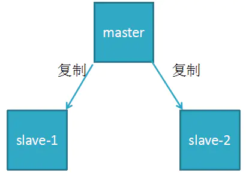

但是这个方案需要解决两个基本问题：

1. 如何提前判断各个节点（尤其是主节点）的运行健康状况？
2. 当主节点宕机的时候如何从多个从节点中选出一个作为新的主节点并实现自动切换？

这时Redis Sentinel应运而生，它主要有以下三个特点：
- 监控(Monitoring)：Sentinel会不断地检查你的主服务器和从服务器是否运作正常。
- 提醒(Notification)：当被监控的某个Redis服务器出现问题时，Sentinel可以通过API向管理员或者其他应用程序发送通知。
- 自动故障迁移(Automatic failover)：当一个主服务器不能正常工作时，Sentinel会开始一次自动故障迁移操作，它会将失效主服务器的其中一个从服务器升级为新的主服务器，并让失效主服务器的其他从服务器改为复制新的主服务器；当客户端试图连接失效的主服务器时，集群也会向客户端返回新主服务器的地址，使得集群可以使用新主服务器代替失效服务器。

总结来说就是sentinrl可以监控一个或者多个master-slaver集群，定时对每个节点进行健康检查，可以通过API发送通知，并自动进行故障转移。这时redis结构就变成了使用redis sentinel之后客户端不再直接连接redis节点获取服务，而是使用sentinel代理获取redis服务，类似nginx的代理模式。那么这里又有一个新问题，就是如果sentinel宕机了，那么客户端就找不到redis服务了，所以sentinel本身也是需要支持高可用。

好在sentinel本身也支持集群部署，并且各个sentinel之间支持自动监控，如此一来redis主从服务和sentinel服务都可以支持高可用。预期结构如下：

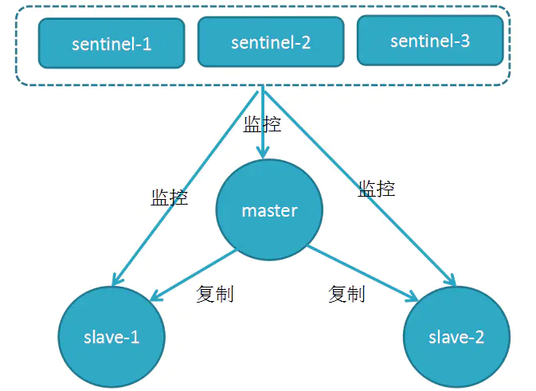

#### 部署实例
master-slaver 一主二从
那么下面来实操以下，以下过程大部分参考redis官方[Redis Sentinel文档](https://links.jianshu.com/go?to=https%3A%2F%2Fredis.io%2Ftopics%2Fsentinel%23redis-sentinel-documentation)

redis解压后，redis home目录下有redsi配置的样例文件，我们不直接在次文件上进行修改，在redis home目录下新建文件夹master-slave，将配置文件都放于此目录下，下面是三个redis节点配置的关键部分。

- master配置文件：redis-6379.conf
```
port 6379
daemonize yes
logfile "6379.log"
dbfilename "dump-6379.rdb"
dir "/opt/soft/redis/data"
```

- slave-1 配置文件：redis-6380.conf
```
port 6380
daemonize yes
logfile "6380.log"
dbfilename "dump-6380.rdb"
dir "/opt/soft/redis/data"
# 关键配置：将这个 redis 指定为某个第一个 redis 的 slaver
slaveof 127.0.0.1 6379
```

- slave-2 配置文件：redis-6381.conf
```
port 6381
daemonize yes
logfile "6381.log"
dbfilename "dump-6381.rdb"
dir "/opt/soft/redis/data"
# 关键配置：将这个 redis 指定为某个第一个 redis 的 slaver
slaveof 127.0.0.1 6379
```

分别启动这三个redis服务，启动后如下图所示：

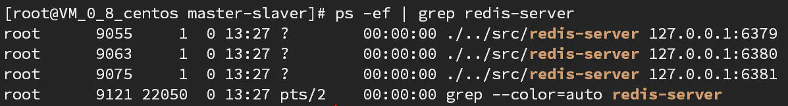

接下来查看这三个redis-server之间的关系：连接到主redis上用info replication即可查看

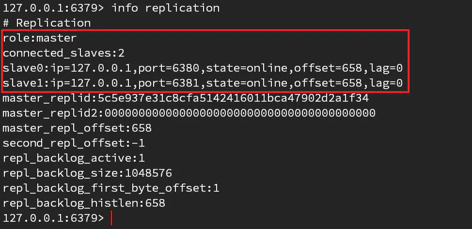

可以看到当前连接的redis服务为master角色，下面有两个slaver，ip和端口都能可拿到。
这样我们就顺利的完成了一主二从redis环境的搭建，下面可iashi搭建sentinel集群。

#### sentinel集群

sentinel本质上是一个特殊的redis，大部分配置和普通的redis没什么区别，主要区别在于端口和其哨兵监控设置，下面是三个典型的sentinel配置文件中的关键内容：

- sentinel-26379.conf
```
#设置 sentinel 工作端口
port 26379
#后台运行 
daemonize yes
#日志文件名称
logfile "26379.log"
#设置当前 sentinel 监控的 redis ip 和 端口
sentinel monitor mymaster 127.0.0.1 6379 2
#设置判断 redis 节点宕机时间
sentinel down-after-milliseconds mymaster 60000
#设置自动故障转移超时
sentinel failover-timeout mymaster 180000
#设置同时故障转移个数
sentinel parallel-syncs mymaster 1
```

- sentinel-26380.conf
```
#设置 sentinel 工作端口
port 26380
#后台运行 
daemonize yes
#日志文件名称
logfile "26380.log"
#设置当前 sentinel 监控的 redis ip 和 端口
sentinel monitor mymaster 127.0.0.1 6379 2
#设置判断 redis 节点宕机时间
sentinel down-after-milliseconds mymaster 60000
#设置自动故障转移超时
sentinel failover-timeout mymaster 180000
#设置同时故障转移个数
sentinel parallel-syncs mymaster 1
```

- sentinel-26381.conf
```
#设置 sentinel 工作端口
port 26391
#后台运行 
daemonize yes
#日志文件名称
logfile "26381.log"
#设置当前 sentinel 监控的 redis ip 和 端口
sentinel monitor mymaster 127.0.0.1 6379 2
#设置判断 redis 节点宕机时间
sentinel down-after-milliseconds mymaster 60000
#设置自动故障转移超时
sentinel failover-timeout mymaster 180000
#设置同时故障转移个数
sentinel parallel-syncs mymaster 1
```

针对几个监控设置的配置做以下详细说明：
- sentinel monitor [master-group-name] [ip] [port] [quorum]

这个命令中[master-group-name]是master redis的名称；[ip]和[port]分别是ip和端口，最后一个是投票数。

举个例子，redis集群中有3个sentinel实例，其中master挂掉了，如果这里的票数是2,表示有2个sentinel认为master挂掉了，才能被认为是真正的挂掉。其中sentinel集群中各个sentinel之间通过gossip协议互相通信。具体怎么投票涉及到redis集群中的[主观下线]和[客观下线]的概念，后面再详细介绍。

- down-after-milliseconds
 
sentinel会向master发送心跳PING来确认master是否存活，如果master在一定时间内不回应PONG或者是回复一个错误消息，那么这个sentinel会主观认为这个master已经不可用了。而这个down-after-milliseconds就是用来指定这个一定时间的，单位是毫秒。

- failover-timeout

这个参数就是sentinel对redis节点进行自动故障转移的超时设置，当failover(故障转移)开始后，在此时间内仍然没有触发任何failover操作，当前sentinel将会认为此次故障转移失败。

- parallel-syncs

当新master产生时，同时进行slaveof到新master并进行同步复制的slave个数，也就是同时几个slave进行同步。因为在salve执行salveof与新master同步时，将会终止客户端请求，因此这个值需要权衡。此值较大，意味者集群终止客户端请求的时间总和较大，次值较小，意味着集群在故障转移期间，多个slave向客户端提供服务时仍然使用旧数据。


然后就可以启动sentinel集群了
启动sentinel有两种方式：
1. redis-sentinel /path/to/sentinel.conf
2. redis-server /path/to/sentinel.conf --sentinel

这两种启动方式没有区别，按照顺序分别启动三个sentinel节点之后，我们任意连接其中的一个sentinel节点查看集群关系，如下图：

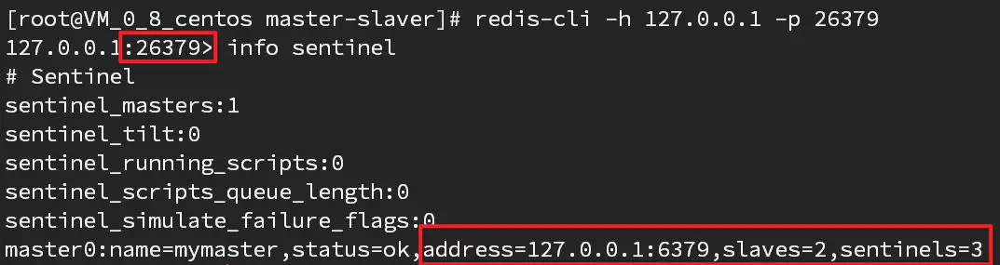

我们连接26379这个端口的sentinel，用info sentinel命令可以看到这个sentinel监控的master redis服务的ip，端口，以及master的slaver节点数量，以及sentinel数量。

再连接263800这个节点试试：

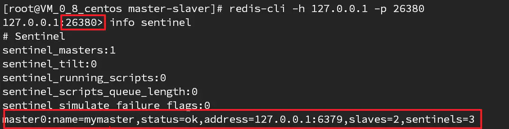

可以看到结果和上面一样。

如此，我们的sentinel集群也部署完成了。

那么，当前这个redis sentinel高可用集群的拓扑图如下：

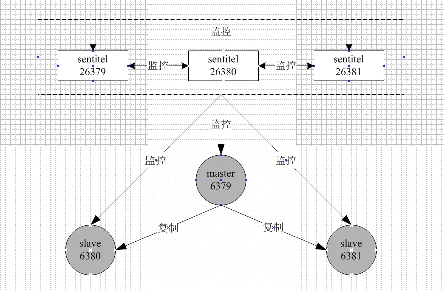

#### 高可用故障测试

下面我们来测试以下这个高可用方案的实际能力。

我们手动把一主二从中的主节点kill掉：

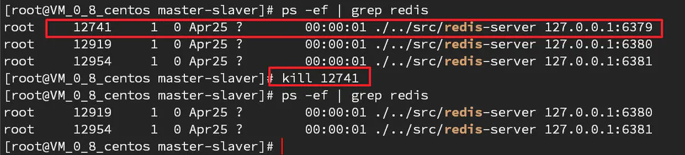

然后连接6380节点，查看集群状态：


可以看到6380节点已经自动升级为master节点，还有6381这一个slaver节点，自动故障转移成功

我们再手动启动6379节点，观察集群状态：

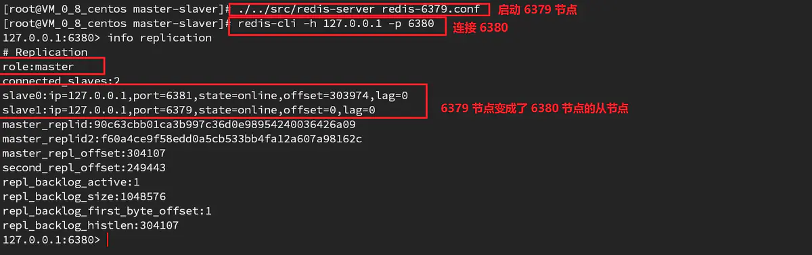

如图，6379节点重新启动后，自动变成了6380节点的从节点。

如此一套完整的redis高可用方案就部署完成了。

#### Redis主观下线和客观下线

前面说过，Redis的Sentinel中关于下线(down)有两个不同的概念：

- 主观下线（Subjectively Down，简称SDOWN）指的是但个Sentinel实例对服务器做出的下线判断
- 客观下线（Objectively Down，简称ODOWN）指的是多个Sentinel实例在对同一个服务器做出SDOWN判断，并且通过SENTINEL is-master-down-by-addr命令互相交流之后，得出服务器下线判断。（一个Sentinel可以通过向另一个Sentinel发送SENTINEL is-master-down-by-addr命令来询问对方是否认为给定的服务器下线）

如果一个服务器没有在master-down-after-milliseconds选项所指定的时间内，对向它发送PING命令的Sentinel返回一个有效回复(valid reply)，那么Sentinel就会将这个服务器标记为主观下线。

服务器对PING命令的有效回复可以是以下三种回复的其中一种：
- 返回+PONG
- 返回-LOADING错误
- 返回-MASTERDOWN错误

如果服务器返回除以上三种回复之外的其他回复，又或者在指定时间内没有回复PING命令，那么Sentinel认为服务器返回的回复无效(non-valid)。

注意，一个服务器必须在master-down-after-milliseconds毫秒内，一直返回无效回复才会被Sentinel标记为主观下线。

举个例子，如果master-down-after-milliseconds选项的值为30000毫秒（30秒），那么只要服务器能在每29秒之内返回至少一次有效回复，这个服务器就仍然会被认为是处于正常状态的。

从主观下线状态切换到客观下线状态并没有使用严格的法定人数算法（strong qourum algrithm），而是使用了流言协议：如果Sentinel在给定的时间范围内，从其他Sentinel那里接收到了足够数量的主服务器下线报告，那么Sentinel就会将主服务器的状态从主观下线改变为客观下线。如果之后其他Sentinel不再报告主服务器已下线，那么客观下线状态就会被移除。

有一点需要注意的是：客观下线条件只适用于主服务器：对于任何其他类型的Redis实例，Sentinel子阿将它们判断为下线前不需要进行协商，所以从服务器或者其它Sentinel永远不会达到客观下线条件。

只要一个Sentinel发现某个主服务器进入客观下线状态，这个Sentinel就可能会被其它Sentinel推选出，并对失效的主服务器执行自动故障迁移操作。

### Redis 分布式高可用方案：Redis Cluster

#### 原理简介
作为一个内存数据库，实现高可用是一个基本保障，当储存服务在可遇见的将来需要用作存储拓展时，分布式储存就是一个必须要考虑到的事情。例如部署一个中央redis储存服务，提供给集团下所有的子公司所有需要的系统使用，并且系统数量在不断的增加，此时在部署服务的时候，分布式储存结构几乎时必然的选择。

Redis3.0版本之前，可以通过前面所说的Redis Sentinel来实现高可用(HA)，从3.0版本之后官方推出Redis Cluster，它的主要用途是实现数据分片(Data Sharding)，同时提供了完整的sharing、replication（复制机制仍使用原有机制，并且具备感知主备的能力）、failover解决方案，称为Redis Cluster，同样可以实现HA，是官方当前推荐的方案。

在Redis Sentinel模式中，每个节点需要保存全量数据，冗余比较多，而在Redis Cluster模式中，每个分片只需要保存一部分的数据，对于内存数据库来说，还是要尽量的减少荣誉。子阿数据量太大的情况下，故障恢复需要较长时间，另外，内存的价格也是比较高的。

Redis Cluster的具体实现细节是采用了Hash槽的概念，集群会预先分配16384个槽(slot)，并将这些槽分配给具体的服务节点，通过对key进行CRC16(key)%16384运算得到对应的槽是哪一个，从而将读写操作转发到该槽所对应的服务节点。当有新的节点加入或者移除的时候，再来迁移这些槽以及其相对应的数据。在这种设计之下，我们就可以很方便的进行动态扩容或缩容。

当然，关于高可用的实现方案，也可以将Redis-Sentinel和Redis-Cluster两种模式结合起来使用，不过比较复杂，并不太推荐。

下图展示了Redis Cluster分配key和slot的基本原理：

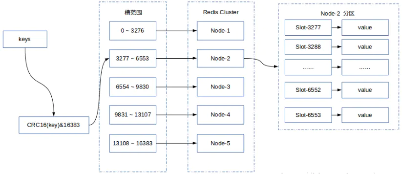

一个典型的Redis Cluster分布式集群由多个Redis节点组成。不同节点组服务的数据无交集，每个节点对应数据sharding的一个分片。节点组内部分为主备2类，对应前面叙述的master和slave。两者数据准实时一致，通过异步化的主备复制机制保证。一个节点组有且仅有一个master，同时有0到多个slave。只有master对外提供写服务，读服务可由master/slave提供。如下所示：

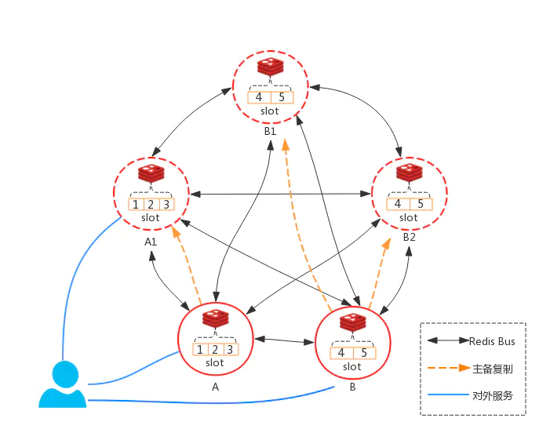

上图中，key-value全集被分成5份，5个slot（实际上Redis Cluster有16384个slot，每个节点服务一段区间的slot，这里面仅仅举例）。A和B为master节点，对外提供写服务。分别负责1/2/3和4/5的slot。A/A1和B/B1/B2之间通过主备复制的方式同步数据。

上述的5个节点，两两通过Redis Cluster Bus交互，相互交换如下信息：
1. 数据分片(slot)和节点的对应关系
2. 集群中每个节点可用状态
3. 集群结构发生变更时，通过一定的协议对配置信息达成一致。数据分片的迁移、主备切换、单点master的发现和其发生主备关系变更等，都会导致集群结构变化
4. publish/subscribe（发布/订阅）功能，在Cluster版内部实现所需要交互的信息

Redis Cluster Bus通过单独的端口进行连接，由于Bus是节点间的内部通信机制，交互的是字节序列化信息。相对Client的字符序列化来说，效率较高。

Redis Cluster是一个去中心化的分布是实现方案，客户端和集群中任一节点连接，然后通过后面的交互流程，逐渐得到全局的数据分片映射关系

#### 部署实例

Redis Cluster集群至少需要三个master节点，本文将以单机多实例的方式部署3个主节点和3个从节点，6个节点实例分别使用不同的端口及工作目录

1. 为每个redis节点分别创建工作目录

在redis安装目录下新建目录redis-cluster，并在该目录下再新建6个子目录，此时目录结构如下图所示：

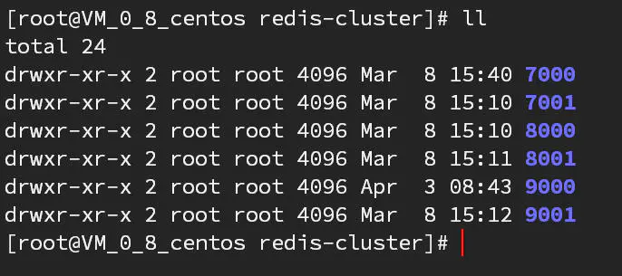

2. 修改配置

```
#开启后台运行
daemonize yes
#工作端口
port 7000
#绑定机器的内网IP或者公网IP,一定要设置，不要用 127.0.0.1
bind 172.27.0.8  
#指定工作目录，rdb,aof持久化文件将会放在该目录下，不同实例一定要配置不同的工作目录
dir /usr/local/redis-cluster/7000/
#启用集群模式
cluster-enabled yes 
#生成的集群配置文件名称，集群搭建成功后会自动生成，在工作目录下
cluster-config-file nodes-7000.conf 
#节点宕机发现时间，可以理解为主节点宕机后从节点升级为主节点时间
cluster-node-timeout 5000 
#开启AOF模式
appendonly yes 
#pid file所在目录
pidfile /var/run/redis_8001.pid 
```

3. 按照上面的样例将配置文件复制到另5个目录下，并对port、dir、cluster-config-file三个属性做对应修改，这里就不一一列举了。

4. 安装Ruby和RubyGems

由于创建redis cluster需要用到redis-trib命令，而这个命令依赖Ruby和RubyGems，因此需要安装以下。
```
[root@VM_0_15_centos redis-cluster]# yum install ruby
[root@VM_0_15_centos redis-cluster]# yum install rubygems
[root@VM_0_15_centos redis-cluster]# gem install redis --version 3.3.3
```

5. 分别启动6个节点

```
[root@VM_0_15_centos redis-4.0.6]# ./src/redis-server redis-cluster/7000/redis.conf
[root@VM_0_15_centos redis-4.0.6]# ./src/redis-server redis-cluster/7001/redis.conf
[root@VM_0_15_centos redis-4.0.6]# ./src/redis-server redis-cluster/8000/redis.conf
[root@VM_0_15_centos redis-4.0.6]# ./src/redis-server redis-cluster/8001/redis.conf
[root@VM_0_15_centos redis-4.0.6]# ./src/redis-server redis-cluster/9000/redis.conf
[root@VM_0_15_centos redis-4.0.6]# ./src/redis-server redis-cluster/9001/redis.conf
```

6. 查看服务运行状态

```
[root@VM_0_15_centos redis-4.0.6]# ps -ef | grep redis
root     20290     1  0 18:33 ?        00:00:02 ./src/redis-server *:8001 [cluster]
root     20295     1  0 18:33 ?        00:00:02 ./src/redis-server *:8002 [cluster]
root     20300     1  0 18:33 ?        00:00:02 ./src/redis-server *:8003 [cluster]
root     20305     1  0 18:33 ?        00:00:02 ./src/redis-server *:8004 [cluster]
root     20310     1  0 18:33 ?        00:00:02 ./src/redis-server *:8005 [cluster]
root     20312     1  0 18:33 ?        00:00:02 ./src/redis-server *:8006 [cluster]
root     22913 15679  0 19:31 pts/2    00:00:00 grep --color=auto redis
```

7. 创建 redis cluster

```
[root@VM_0_15_centos redis-4.0.6]# ./src/redis-trib.rb create --replicas 1 172.27.0.8:7000 172.27.0.8:7001 172.27.0.8:8000 172.27.0.8:8001 172.27.0.8:9000 172.27.0.8:9001
```

创建过程中会有部分需要确认的地方，按照提示输入即可，集群创建完毕后观察一下这个集群的节点状态

```
172.27.0.8:7000> cluster nodes
068ac2afe1ade8b69b83226453fecc2b79cd93ae 172.27.0.8:7001@17001 slave 421ebe9e0a5ac6c811935ecd9dba83ef119dec17 0 1531008204920 4 connected
784c727c83a5952d3714ac211021f909cc4dfee4 172.27.0.8:8001@18001 slave eb5d700e2f030c02fb1f30ba4420d0b4f7170d84 0 1531008203000 5 connected
0537099e7cc7ab595c7aad5f0c96985251b85ec0 172.27.0.8:9001@19001 slave 79262341417df0a11eaf31e72bbf3e26f5f60ebf 0 1531008204419 6 connected
421ebe9e0a5ac6c811935ecd9dba83ef119dec17 172.27.0.8:7000@17000 myself,master - 0 1531008204000 1 connected 0-5460
eb5d700e2f030c02fb1f30ba4420d0b4f7170d84 172.27.0.8:8000@18000 master - 0 1531008203000 2 connected 5461-10922
79262341417df0a11eaf31e72bbf3e26f5f60ebf 172.27.0.8:9000@19000 master - 0 1531008203419 3 connected 10923-16383
```

如上所示，一个3主3从的redis cluster分布式集群就搭建成功了，7000、8000、9000分别是三个master节点，7001、8001、9001为对应的slaver节点。

其实如果你并不想管这么多配置而只是想在最快的速度内创建一个redis cluster用作测试或者其它用途，redis官方在redis安装目录的Utils目录下它哦共了一个create-cluster的脚本，如下图：

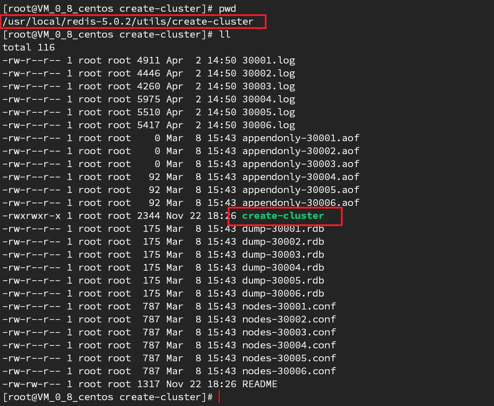

只要执行一下这个脚本就能自动创建一个cluster，进入到这个目录下，执行./create-cluster start，即可立即完成一个三主三从的redis cluster的搭建：

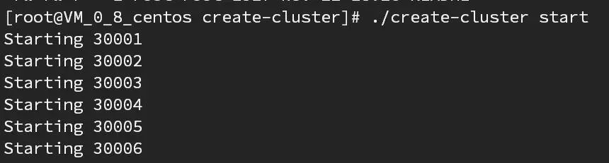

如下图所示就是直接使用这个脚本创建的redis cluster：

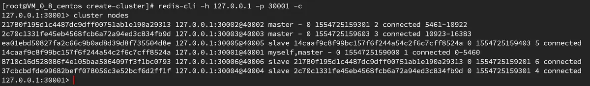

#### Tips

1. 如果想重新创建集群，需要登陆到每个节点，执行flushdb，然后执行cluster reset，重启节点
2. 如果要批量杀掉Redis进程，可以使用pkill redis-server命令
3. 如果redis开启密码认证，则需要在redis.conf中增加属性：masterauth yourpassword，并且需要修改/usr/local/share/gems/redis-3.3.3/lib/redis，目录下的client.rb文件，将password属性设置为redis.conf中的require pass的值，不同操作系统client.rb的位置可能不一样，可以使用find / -name "clinet.rb"全盘查找一下

```
 DEFAULTS = {
      :url => lambda { ENV["REDIS_URL"] },
      :scheme => "redis",
      :host => "127.0.0.1",
      :port => 6379,
      :path => nil,
      :timeout => 5.0,
      :password => "yourpassword",
      :db => 0,
      :driver => nil,
      :id => nil,
      :tcp_keepalive => 0,
      :reconnect_attempts => 1,
      :inherit_socket => false
    }
```

4. Reids开启密码认证后，在集群操作时问题会比较多，因此在非特殊情况下不建议开启密码认证。可以搭配使用防火墙保证Redis的安全

## 总结

Redis服务的部署方案的选型大家根据自己项目的需求部署即可，一般来说redis sentinel就够用了，也就是目前用得最多的模式，但是redis3.0之后官方推出的redis-cluster虽然本质时用于实现数据分片和分布式存储，但是其也实现了redis sentinel的全部功能，有完全的HA能力，并且部署起来更简单，因此成为了官方推荐的HA方案，我个人也更加推荐redis cluster方案。