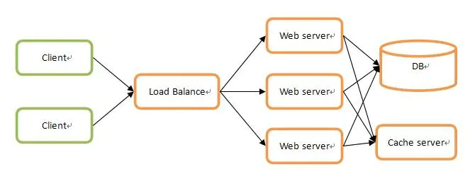

<!--
 * @Author: zhangjiaxi
 * @Date: 2021-03-03 11:13:50
 * @LastEditors: zhangjiaxi
 * @LastEditTime: 2021-03-03 11:28:53
 * @FilePath: /learning_note/redisDistribute.md
 * @Description: 
-->
# Redis分布式指南

## 分布式与集群

目前的项目很少会采用单机架构了，一是因为单机性能有限，二是因为单机服务一旦故障整个系统就无法继续提供服务了。通过分布式架构解决性能（高并发）问题，通过集群架构解决故障服务（高可用）问题。

## 分布式架构

按照类型大致可以分为两种：分布式计算和分布式存储。

分布式计算很好理解，就是将大量激素那任务分配到多个计算单元上以提高总计算性能。例如暴力破解某个密码需要遍历某个字符组合10万次，假设一台计算机需要10分钟，那么10台计算机同时遍历，每台遍历1万次，最后将结果汇总，那么就只需要1分钟。这10台计算机组合起来就是一个分布式计算系统，这里的业务就是计算。

同理，分布式存储就是将大量数据分配到多个存储单元上以提高总存储量。

## 集群架构

集群：同一业务，部署在多个服务器上，这样可以起到两个作用：
- 分散每台服务器的压力
- 任意一台或者几台服务器宕机也不会影响系统

例如一个典型的web集群服务架构图如下：

这里三个web Server实际上都是运行者同一套业务，但是三台服务器就可以显著分散单台服务器压力，并且任意一台宕机也不会导致无法提供服务。

## 分布式与集群的关系

https://www.jianshu.com/p/21110d3130bc