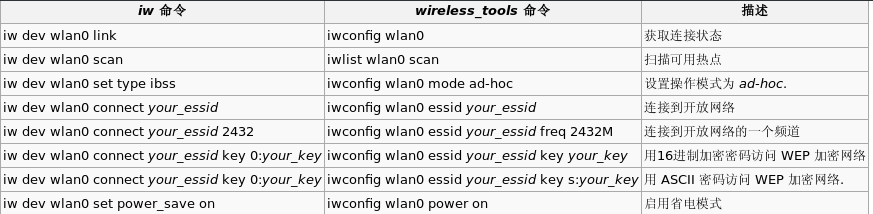

# setup-archlinux

## U盘启动准备
1. 下载archlinux的iso文件，链接：https://www.archlinux.org/download/
2. 如果是Linux系统环境下，推荐使用dd命令，教程链接：https://www.linuxidc.com/Linux/2018-08/153578.htm。如果是windows系统环境下，推荐使用rufus，下载链接：https://github.com/pbatard/rufus/releases/download/v3.9/rufus-3.9.exe

## 磁盘准备
- Windows
    - 右击windows图标，在弹出菜单中选择磁盘管理（其他版本的windows请自行找到打开磁盘管理的方式）
    - 右击想删除的分区，选择删除卷（注意这步之后这个分区的所有数据将会丢失）
- Linux
    - 使用fdisk操作，教程链接：https://www.linuxidc.com/Linux/2018-08/153580.htm
- 空磁盘
    - 不需要进行任何操作

## 进入U盘下的Linux系统
- 检查引导方式
    - 目前的引导方式主要分为EFI引导+GPT分区表与BIOS（LEGACY）引导+MBR分区表两种，几乎比较新的机器都采用了EFI/GPT引导方式。
    - 如果不知道自己的引导方式，可在命令提示符下执行命令：``` ls /sys/firmware/efi/efivars ```，如果提示``` ls:cannot access '/sys/firmware/efi/efivars':No such file or directory ```，表明你是以BIOS方式引导，否则为以EFI方式引导。现在只需记住这个信息，之后会用到。
- 联网
    - arch并不能离线安装，因为我们需要联网来下载需要的组件。
    - 如果是有线网并且路由器支持DHCP的话插上网线，如果是静态IP，编辑/etc/dhcpcd.conf，添加

            static ip_address=192.168.x.x
            static routers=192.168.x.1
            static domain_name_servers=192.168.x.x

        如果是动态IP，则不需要编辑。

        然后编辑/etc/hosts

            127.0.0.1 localhost
        
        接着编辑/etc/resolve.conf

            nameserver 114.114.114.114
            nameserver 8.8.8.8
        最后在命令提示符下：
            
            dhcpcd
- 更新系统时间
    - 命令行提示符下执行
        ```
        timedatectl set-up true
        ```
## 分区与格式化

- 查看目前分区情况，执行命令：

    ```bash
    fdisk -l
    ```

    - 如果你是BIOS/MBR方式引导，跳过创建一个引导分区的步骤。
    - 如果你是EFI/GPT方式引导，并且同时安装了其他系统，那么应该可以在分区列表中发现一个较小的并且类型为EFI的分区（注意查看硬盘的大小，这个EFI分区有可能是U盘中的，需要排除），这是你的引导分区，请记下它的路径（/dev/sdxY）备用，跳过下面创建一个引导分区的步骤。
    - 如果你是EFI/GPT方式引导，但是没有这个娇小的并且类型为EFI的引导分区（这种情况一般只会出现在新的硬盘），那么你需要先创建一个引导分区。
- 创建一个引导分区
    1. 执行命令：(将sdx替换成你要操作的磁盘)

        ```
        fdisk /dev/sdx
        ```
    2. 如果你是一块全新的磁盘，输入g来创建一个全新的gpt分区表，否则直接进行第3步。
    3. 输入n创建一个新的分区，首先会让你选择起始扇区，一般直接回车使用默认数值即可，然后可以输入结束扇区或是分区大小，例如输入+512M来创建一个512M的引导分区。
    4. 这时我们可以输入p来查看新创建的分区。
    5. 输入t并选择新创建的分区序号来更改分区的类型，输入l可以查看所有支持的类型，输入ef更改分区的类型为EFI。
    6. 输入w来将之前所有的操作写入磁盘生效，在这之前输入p来确认自己的分区表没有错误
- 创建根分区
    1. 执行命令：(将sdx替换成你要操作的磁盘)
        ```
        fdisk /dev/sdx
        ```
     2. 如果你是一块全新的硬盘，否则直接进行第3步：
        - 如果你是BIOS/MBR引导方式：输入o来创建一个全新的MBR分区表
        - 如果你在上一步新建了分区表并创建了引导分区：直接进行步骤3
        - 如果你在另一块硬盘中已经有引导分区，输入g创建一个全新的gpt分区表
    3. 输入n创建一个新的分区，可直接回车使用默认
    4. 这时可输入p来查看新创建的分区
    5. 输入w来将之前的所有操作写入磁盘生效，在这之前可以输入p来确认自己的分区表
    6. 输入以下命令来格式化刚刚创建的根分区：
        ```
        mkfs.ext4 /dev/sdxY
        ```

- 挂载分区
    - 执行命令：(sdxY替换为之前创建的根分区)

        ```
        mount /dev/sdxY /mnt
        ```
    - 如果你是EFI/GPT引导方式，执行以下命令创建/boot文件目录并将引导分区挂载到上面，BIOS/MBR引导方式无需进行这步。（sdxZ替换为之前创建的引导分区）
        ```
        mkdir /mnt/boot
        mount /dev/sdxZ /mnt/boot
        ```
    - 编辑/etc/pacman.d/mirrorlist，更改镜像源，推荐163，阿里云镜像源：

        ```
        Server = http://mirrors.163.com/archlinux/$repo/os/$arch
        Server = http://mirrors.aliyun.com/archlinux/$repo/os/$arch
        ```
    - 安装archlinux基本包到磁盘根分区上，这一步需要联网，执行以下命令：

        ```
        pacstrap /mnt base base-devel
        ```
    - 生成自动挂载分区的Fstab文件，执行以下命令：
        ```
        genfstab -L /mnt >> /mnt/etc/fstab
        ```
        通过以下命令检查输出文件是否正确：
        ```
        cat /mnt/etc/fstab
        ```
        如果文本中出现根分区的信息，则说明这一步操作成功
## Change root
    - 切换到新安装的Linux系统root账户，执行以下命令：
        ```
        arch-chroot /mnt
        ```
        如果以后磁盘上的系统有问题需要解决，都只需要插入U盘启动盘，将系统的根分区挂载到/mnt下，有EFI分区也要挂载到/mnt/boot下，再通过此命令进入磁盘系统进行修复操作。
    - 设置时区，执行以下命令：
        ```
        ln -sf /usr/share/zoneinfo/Asia/Shanghai /etc/localtime
        hwclock --systohc
        ```
    - 安装必备包，执行以下命令：
        ```
        pacman -S vim dialog wpa_supplicant ntfs-3g networkmanager iw dhcpcd
        ```
    - 设置主机名，将下面的myhostname替换成自己设定的主机名
        ```
        vim /etc/hostname
        vim /etc/hosts

        127.0.0.1 localhost.localdomain localhost
        ::1       localhost.localdomain localhost
        127.0.0.1 myhostname.localdomain myhostname
        ```
    - 设置root密码，执行以下命令：
        ```
        passwd
        ```
    - 安装Inter-ucode（非InterCPU可以跳过此步骤），执行以下命令：
        ```
        pacman -S intel-ucode
        ```
    - 安装Bootloader
        ```
        pacman -S os-prober
        ```
    - 安装grub包
        - 如果是BIOS/MBR引导方式
            - 安装grub包
                ```
                pacman -S grub
                ```
            - 部署grub（将sdx换成你安装的硬盘）
                ```
                grub-install --target=i386-pc /dev/sdx
                ```
            - 生成配置文件
                ```
                grub-mkconfig -o /boot/grub/grub.cfg
                ```
        - 如果是EFI/GPT引导方式
            - 安装grub与efibootmgr两个包
                ```
                pacman -S grub efibootmgr
                ```
            - 部署grub
                ```
                grub-install --target=x86_64-efi --efi-directory=/boot --bootloader-id=grub
                ```
            - 生成配置文件
                ```
                grub-mkconfig -o /boot/grub/grub.cfg
                ```
    - 安装检查，如果你是多系统，请注意上面一节对os-prober这个包的安装。建议使用如下命令检查是否成功生成各系统的入口，如果没有正常生成会出现开机没有系统入口的情况：
        ```
        vim /boot/grub/grub.cfg
        ```
    检查接近末尾的menuentry部分是否有windows或者其他系统名入口，如下图所示
    
    如果没有看到Arch Linux系统入口或者该文件不存在，请先检查/boot目录是否正确部署linux内核：
    ```
    ls /boot
    ```
    查看是否有initramfs-linux-fallback.img initramfs-linux.img intel-ucode.img vmlinuz-linux这几个文件，如果都没有，说明linux内核没有被正确部署，很可能是/boot目录没有被正确挂载导致的，确认/boot目录无误后，可以重新部署linux内核：
    ```
    pacman -S linux
    ```
    再重新生成配置文件，就可以找到系统入口。
    如果还没有生成其他系统的入口，请编辑配置文件手动添加引导的分区入口。
    - 重启，执行以下命令：
        ```
        exit
        reboot
        ```
## 安装后配置wifi
- 查看wifi驱动是否正常
    ```
    ip link
    ```
- 如果有w开头的驱动，说明wifi驱动正常

- 如果没有w开头的驱动，说明wifi驱动不正常，需要下载对应型号的驱动，通过以下命令查看无线网卡型号
    ```
    lspci -k
    ```
    到网上下载对应型号的wifi驱动并安装
- 通过以下命令激活无线网卡，假设网卡名为wlan0
    ```
    ip link set dev wlan0 up
    ```
- 如果之间有开机自启dhcpcd，则需要关闭（后面再找原因）：
    ```
    systemctl disable dhcpcd.service
    ```
- 连接到公共网络和WEP加密网络
    - 对于这种情况，只需只用iw工具即可：以下是iw终端命令：
    
    - 例如要连接一个名为HIT-WLAN的公共网络，则只需用命令
        ```
        iw dev wlan0 connect HIT-WLAN
        ```
    - 可用以下命令扫描附近热点
        ```
        iw dev wlan0 scan
        ```
- 连接到WPA2PSK或者WPA加密网络
    - 假设wifi名为mywifi，密码是123456
        ```
        wpa_passphrase mywifi "123456" > /etc/wpa_supplicant.conf
        wpa_supplicant -B -i wlan0 -c /etc/wpa_supplicant.conf
        ```
        第一步是将wifi名和wpa_passphrase加密后的密码写入wpa_supplicant.conf文本
        其中第二步-B表示后台运行
- 开启dhcpcd
    ```
    dhcpcd wlan0
    ```
- 关闭wifi
    - 若是动态ip地址，关闭的时候直接用命令
        ```
        ip link set dev wlan0 down
        dhcpcd wlan0 -x
        ```
    - 若是静态ip地址，为了更好的关闭，可以用以下命令
        ```
        ip addr flush dev wlan0
        ip route flush dev wlan0
        ip link set dev wlan0 down
        dhcpcd wlan0 -x
        ```
- 手机网络共享
    - 手机开启“usb网络共享”，用数据线连接电脑，最后直接dhcpcd动态获取ip即可