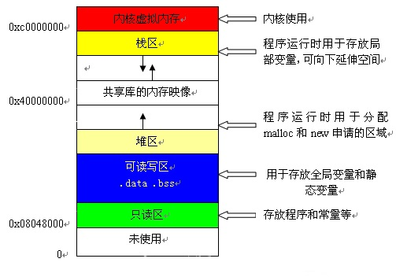

# 数据结构中的堆栈和内存分配中的堆栈
## 数据结构的堆栈

堆和栈都是一种数据项按序排列的数据结构。

栈就像装数据的桶或箱子，是一种具有后进先出性质的数据结构，也就是说后存放的先取，先存放的后取。堆像一棵倒过来的树，是一种经过排序的树形数据结构，每个节点都有一个值。通常我们所说的堆的数据结构，是指二叉堆。堆的特点是根节点的值最小（或最大），且根节点的两个子树也是一个堆。因为堆的这个特性，经常使用来实现优先队列，堆的存取是随意的。

## 内存分配中的堆和栈

内存中的栈区处于相对较高的地址以地址的增长方向为上的话，栈地址是向下增长的。栈中分配局部变量空间。堆区是向上增长的用于分配程序员申请的内存空间。另外还有静态区是分配静态变量，全局变量空间的，仅读区是分配常量和程序代码空间的，以及其他一些分区。

## 内存分区

内存主要分为五个区，分别是代码区、栈区、堆区、静态（全局）数据区。

### 代码区
代码区是用来储存程序的所有代码，以及字符串常量等在编译期间就能确定的值，在程序的整个生命周期内，在常量数据区的数据都是可用的。在这个区域内，所有的数据都是只读的，不可以修改本区域的数据，之所以这样，是因为在实际的实现中，最底层内部存储格式的实现会使用特定的优化方案。比如说，编译器可能只把字符串常量存储一次，而在几个重叠的对象里面引用它。

### 栈区
栈区主要存放编译器在需要的时候自动分配，在不需要的时候自动销毁的变量。主要是局部变量和函数的参数等，在函数调用和传参的时候，编译器为局部变量或形参开辟空间，注意，在这块空间中，编译器并不会自动对它进行任何的初始化，它所保存的不是0，而是一个随机值（可能是该存储区上次被使用后的值），在函数结束后，所开辟的空间将自动销毁，里面所存的内容将不复存在，也就是释放存储区的内容。当一个自动变量的地址被存储在一个生命期长于它的指针时，自动变量被释放后，该指针就成了一个“悬空指针”，“悬空指针”的内容是无法预测的。

### 全局静态区
全局静态区是用来存储全局静态变量的存储区域，只有在程序启动的时候才被分配，直到程序开始执行时才被初始化，比如：函数的静态变量就是在程序执行到定义该变量的代码时才被初始化的。在静态区数据区中没有被初始化的区域可以通过void*指针来访问或操纵，但是，static定义的静态变量只能在本文件中使用，不可在其它文件中声明使用。

### 堆区
堆区是一个动态的存储区域，使用库函数malloc和free，和操作符new和delete以及一些相关变量来进行分配和回收，在堆区中，对象的生命周期可以比它存在内存中的生命周期短，换句话说：程序可以获得一片内存区域而不用马上对它进行初始化，同时，在对象被销毁后，也不用马上收回它所占用的内存区，在这段时间内，用户可以用void*型的指针访问这片区域，但是原始对象的非静态区以及成员函数都不能被访问或者操纵，因为我们知道实际上对象已经不存在了。